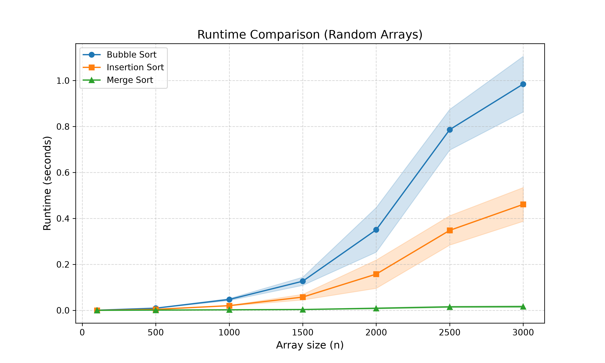
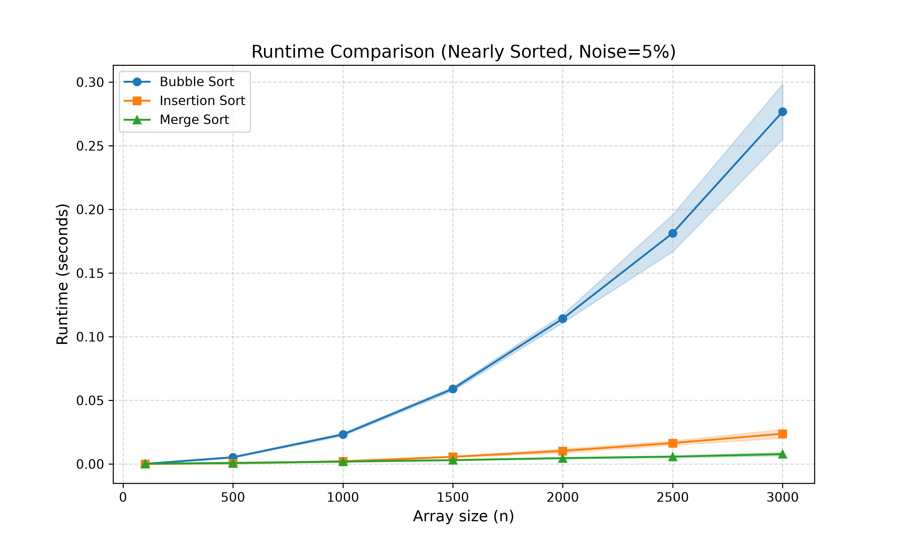

# Sorting Algorithms Empirical Analysis
By Ron Ben Shooshan (208158642)

## Overview
This project implements and empirically analyzes three fundamental sorting algorithms:
*Bubble Sort* *Insertion Sort*
*Merge Sort* 

The primary goal of this project is to analyze and compare their performance characteristics under different theoretical cases using randomized and nearly-sorted arrays of varying sizes.

## Empirical Results
###  Performance on Randomized Arrays
The graph below illustrates the running time (execution time) of Bubble Sort, Insertion Sort, and Merge Sort when executed on completely randomized arrays. 
As expected theoretically, Merge Sort ($O(n \log n)$) significantly outperforms the quadratic algorithms ($O(n^2)$) as the input size ($n$) grows.

###  Performance on Nearly-Sorted Arrays
The second graph demonstrates the performance of the three algorithms when dealing with nearly-sorted arrays. This case highlights the strengths of Insertion Sort, which achieves a near-linear $O(n)$ time complexity, making it highly competitive and often faster than Merge Sort for this specific scenario.

## Key Takeaways
1. **Merge Sort** is the most reliable and scalable choice for large, unpredictable datasets due to its consistent sub-quadratic growth.
2. **Insertion Sort** is exceptionally efficient for datasets that are already mostly sorted or very small in size, outperforming even more advanced algorithms in these contexts.
3. **Bubble Sort** serves as a good conceptual introduction to sorting but is highly inefficient for practical or large-scale applications.